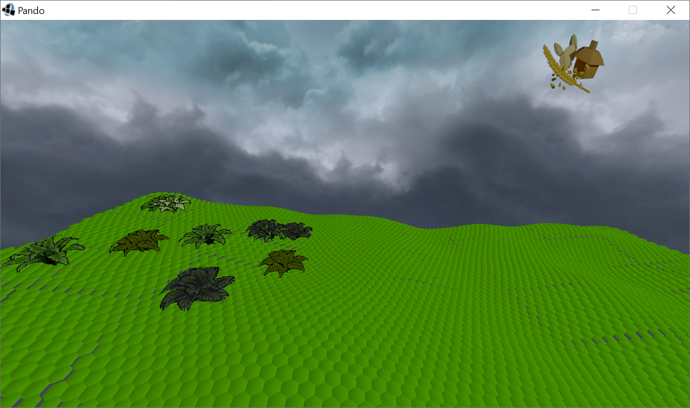
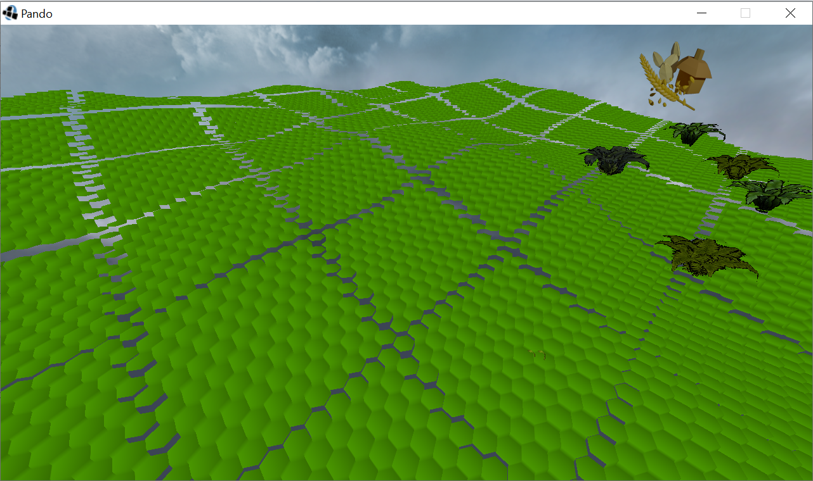

# Pando

CS 2019 Passion Project

Donny Ren, Misha Melnyk, Keagan Allen, Matthew Zhou

(listed in order of decreasing IQ)

(Just kidding we love you Matthew)

OpenGL for rendering hexagonal terrain.

Raytracing with the power of math for 100% accuracy!.

(The focus is the two sprouts near the bottom of the image.
One of them is the cursor position and the other is calculated to be placed on the hexagon that the cursor is selecting.)

